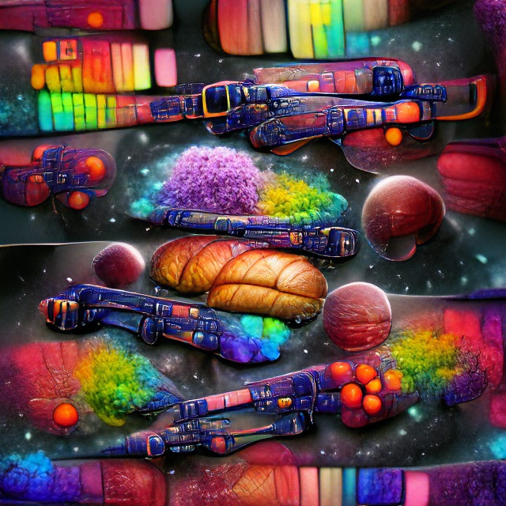

# Coach Me Bot

A lightweight local Twitch Bot written in C++. The behaviour of commands is defined in a lua script. This allows for easy expansion and customization.

## Dependencies

 - ASIO STANDALONE
*sudo apt-get install -y libasio-dev*
 - LUA 5.1
*sudo apt-get install -y lua5.1*

## Getting Started

1) Satisfy dependencies.
2) Clone the repository.
3) Build with 'make'. Build and execute with 'make run'.
  If necessary, modify the include paths for *lua5.1* in the makefile.
4) Modify the '_oauth' (twitch token) and '_botname' (account name) variables in *config.lua*. Point the bot to the     desired channel modifying '_channel'.
5) Start adding custom commands in *commands.lua*

## Development Checklist

+ Net framework: client and connection interfaces (ASIO).
+ Implemented simple bot that receives and displays Twitch Chat.
+ Embedding Lua: Configuration params and commands obtained from 'config.lua' file.
+ Integrated FLITE text to speech generator.
+ Implemented customs params that trigger Lua scripts.

## Stay in touch

+ Linkedin - https://www.linkedin.com/in/manuel-tabares/

 

    
    Science-fiction Galaxy - AI generated (vqgan+clip)

